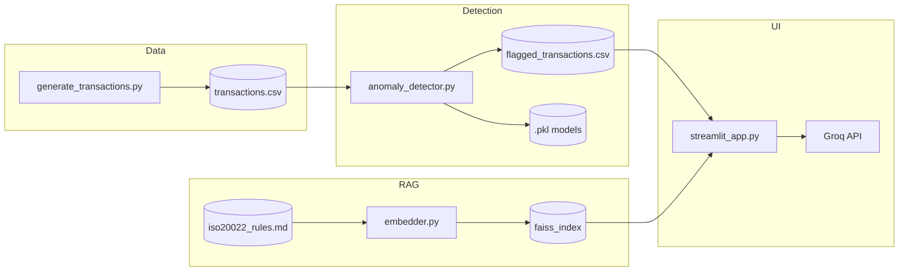

# Payment Anomaly Explainer

A small end-to-end demo that **detects unusual payment transactions** with classical ML and **explains flags in compliance language** using **RAG** (retrieval from an ISO 20022–style rule book) and a **Groq** LLM. A **Streamlit** app lets you browse flagged rows and generate explanations.

This repository is educational: synthetic data, not production fraud scoring.

---

## What this project does

1. **Synthetic data** — Generates 500 payment rows (475 “normal” + 25 injected anomalies) to `artifacts/transactions.csv`.
2. **Anomaly detection** — Trains an **Isolation Forest** (unsupervised) and an **XGBoost** classifier on labeled columns, blends scores, and writes the top-risk rows to `artifacts/flagged_transactions.csv` (27 rows in the default configuration). Model artifacts are saved as `.pkl` under `artifacts/`.
3. **Knowledge base** — Ten compliance rules live in `knowledge_base/iso20022_rules.md` (markdown, `Rule 001` … `Rule 010`).
4. **Embeddings + FAISS** — Rules are embedded with `sentence-transformers/all-MiniLM-L6-v2` and indexed with **FAISS** under `artifacts/faiss_index/` (first run downloads the embedding model).
5. **RAG explainer** — For a given transaction text, the app retrieves relevant rules and calls **Groq** (`llama-3.1-8b-instant`) to produce three sections: why it was flagged, which rules apply, recommended next steps.
6. **Dashboard** — **Streamlit** UI to inspect flagged transactions and run the explainer.



---

## Repository layout

| Path | Role |
|------|------|
| `data/generate_transactions.py` | Builds synthetic CSV |
| `models/anomaly_detector.py` | Isolation Forest + XGBoost, saves models and flagged CSV |
| `models/embedder.py` | Embeds rules, builds/saves FAISS index |
| `knowledge_base/iso20022_rules.md` | Rule text used for retrieval |
| `rag/explainer_chain.py` | Retrieve rules + Groq completion (CLI test included) |
| `app/streamlit_app.py` | Web dashboard |
| `artifacts/` | Generated data, models, FAISS (gitignored) |
| `requirements.txt` | Python dependencies |
| `.env` | Optional local config (gitignored); used at runtime if present |

---

## Prerequisites

- **Python** 3.11+ (3.13 works with the current dependency ranges).
- **Groq** access for the LLM-powered explainer and dashboard. Configure credentials in your own environment the same way you would for any small Groq + LangChain app; do not commit secrets to the repository.

---

## Setup

### 1. Clone and virtual environment

```bash
git clone <your-repo-url>
cd Payment-Anomaly-Explainer   # or your folder name
python -m venv venv
```

Activate:

- **Windows (PowerShell):** `.\venv\Scripts\Activate.ps1`
- **macOS/Linux:** `source venv/bin/activate`

### 2. Install dependencies

```bash
pip install -r requirements.txt
```

The file allows slightly flexible versions for **pandas**, **scikit-learn**, **faiss-cpu**, and **langchain** packages so installs succeed on current Python versions and Windows without building from source.

---

## Run the pipeline (order matters)

From the project root, with the venv activated:

```bash
python data/generate_transactions.py
python models/anomaly_detector.py
python models/embedder.py
```

**Outputs (under `artifacts/`):**

- `transactions.csv` — full synthetic dataset  
- `flagged_transactions.csv` — rows surfaced as highest risk (27 by default)  
- `iforest.pkl`, `xgb_scorer.pkl`, `detector_preprocess.pkl` — trained models and encoders  
- `faiss_index/` — FAISS vector store for rules  

**Test the LLM + RAG from the CLI:**

```bash
python rag/explainer_chain.py
```

You should see a three-part compliance-style explanation printed to the terminal.

**Launch the dashboard:**

```bash
streamlit run app/streamlit_app.py
```

Open the URL shown in the terminal (typically `http://localhost:8501`). Pick a flagged transaction and click to generate an explanation.

---

## How detection works (short)

- Features include amount, log-amount, hour, day-of-week, and encodings for payment rail and sender BIC.
- **Isolation Forest** is fit with contamination tuned so the ensemble targets a fixed number of top-risk rows.
- **XGBoost** is trained on the synthetic `is_anomaly` label.
- A **blended risk score** combines normalized IF scores and XGB fraud probabilities; the top **27** rows are exported as “flagged” for the demo.

---

## How RAG works (short)

- Each rule block in `iso20022_rules.md` becomes one document chunk.
- Queries use the same embedding model as at index time; **FAISS** returns the closest rule texts.
- The Groq model receives retrieved context plus the transaction description and is instructed to answer in three numbered sections.

---

## Security and privacy

Treat API keys and any local credential files like normal secrets: keep them out of version control and rotate them if leaked.

`artifacts/` is gitignored; regenerate locally after clone if you want the full UI without checking in large CSVs or indices.

---

## Troubleshooting

| Issue | What to try |
|--------|-------------|
| Authentication errors from Groq | Verify your Groq account and that API access is enabled for the project. |
| `pip` tries to compile pandas / sklearn | Use Python 3.11–3.12 with wheels, or stay on 3.13 and ensure `requirements.txt` installs binary wheels (`pip install --upgrade pip` first). |
| Streamlit says run the pipeline first | Run the three `python` steps above so `artifacts/transactions.csv` and `flagged_transactions.csv` exist. |
| FAISS / embedding first run slow | First run downloads `all-MiniLM-L6-v2`; later runs reuse the cache. |


---

## Acknowledgements

- **Groq** for fast LLM inference APIs  
- **LangChain** ecosystem (community integrations, Hugging Face embeddings)  
- **sentence-transformers**, **FAISS**, **scikit-learn**, **XGBoost**, **Streamlit**
